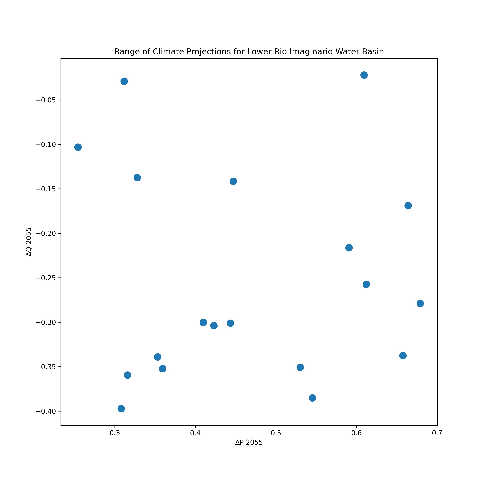
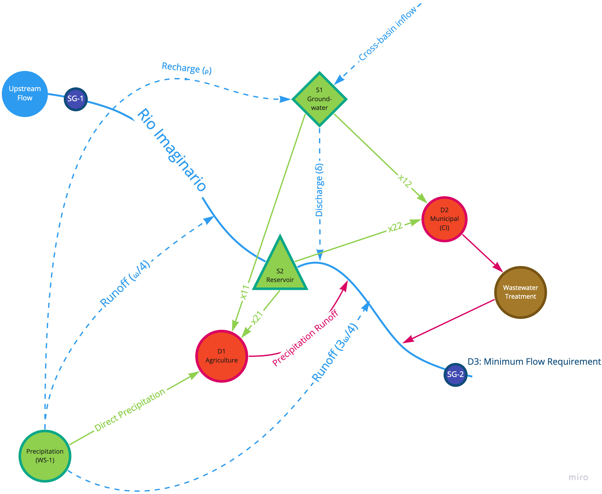

# Narrative and Background

The Rio Imaginario Inferior Servicio de Agua (RIISA) is responsible for providing water to the city of Ciudad Imaginario (CI), which had a population of over 4.5 million in 2020. RIISA is also responsible for ensuring water is available to a small (150 $\mbox{km}^2$) agricultural basin in the region. The basin relies heavily on two sources: the Rio Imaginario and a large groundwater basin. Inflows from the Rio Imaginario rely on glacial melt, snowmelt, and precipitation from the Sierra Grande mountains upstream. Groundwater is primarily driven by local precipitation, though a small amount of groundwater flows into the basin from outside of the region. 

Municipal demand for water are expected to increase in the future. Population is projected to increase by 27% by 2055, though this is uncertain. Experts agree that the feasible range of population growth is somewhere between 15% and 40%. Future agricultural activity is highly uncertain, and projections currently show constant agricultural until 2055. Nationally, some experts project that cropland could increase by 20%, while others project a possible decline of up to 15%. 

Baseline modeling indicates that the RIISA system could be vulernable to shortages if current climatic conditions continue. 

However, climate change is expected to exaccerbate the problem. Due to reductions in snowfall and precipitation near the headwaters of the Rio Imaginario, downscaled GCMs project that inflows into the lower basin are expected to be reduced by up to 40% by 2055 relative to the 2011-2020 10-year period. However, annual local precipitation could increase by up to 70% by 2055 relative to the 2011-2020 baseline. There is significant seasonal variation in these deltas.

Potential adaption levers include:

- Increasing the capacity of the reservoir
- Increasing the efficiency of agricultural use (up to 25%)
- Increasing the efficiency of municipal use (up to 15%)
- Increasing (or restricting) pumping capacities on any of the 4 transmission routes
- Increasing the amount of water that is recycled at CI (up to 50%)
- Increase the wastewater treatment capacity (currently 0.5 $\mbox{m}^3/\mbox{s}$)—which allows treated wastewater to flow back into the Rio Imaginario downstream of all withdrawls and upstream of the minimum flow requirement.

# Assignment

Pair off into groups of 2 or 3. Your group will use python scripts, jupyter notebooks, and data in `crdm_project` folder to analytical RDM process using local parallelization (you are welcome to use any other service) a local RDM process using the RIISA Water Resources Model. This process should include:

- at least 250 plausible futures against
- at least 4 strategies.

The `crdm_project` directory contains all the information you should need to run this, including:

- information on potential states of the future for model input variables (climate data are available in `./ref/`, while other information on uncertainties are available in the narrative)
- documentation of the model (herein)
- A dataset containing historical and baseline projected model inputs (`ri_baseline_trajectory_model_input_data.csv`).

You are welcome (and encouraged) to draw from other materials— including other files, scripts, and notebooks—used in the class to construct a working process.

### Tasks

- Complete an XLRM matrix.
- Develop scripts to generate modeling input database.
- Include any applicable parameter input files, reference files, etc.
- Run at least 250 potential futures of the model over at least 4 different strategies using parallelization.
- Collect the results in an output database.
- Describe model results and whether or not the model appears to be valid.

### Deliverables
- XLRM Matrix
- Self-contained codebase (could be a version of the `crdm_project` directory) that works on Windows, Mac OS, or Linux. 
- Brief presentation (10-15 minutes) detailing:
	- XLRM matrix
	- Your computational process
	- Comparison of run times for serial vs. parallel
	- Discussion of face validity
	- Inputs of interest
	- Outputs of interest
	- **Any** issues with the model you find

The presentations will occur on the last day of the tutorial. The codebase may be sent up to a week after the tutorial concludes. 

# Rio Imaginario River Basin Water Model

The "Rio Imaginario" river basin model represents a simple(r) implementation of a water system model in python. The model is conceptually similar to a WEAP model. This model serves as a bridge between simpler toy models used to illustate the RDM methodology and more complex models used to inform decisionmaking. The model minimizes weighted unmet demand—each demand node is associated with a cost, and higher costs incur higher penalties in the objective function. Higher costs represent higher priority nodes. 

## The Rio Imaginario Water System

The Rio Imaginario water system is a simplified, illustrative water management system that contains the following components. 

- 2 supply inflows:
    - The Rio Imaginario river, which is representative of a lower-latitude northern hemisphere glacier and snowpack-fed river (snowmelt and runoff drives high flows during the spring). This flow is denoted by the time series variable $\{Q_t\}_{t \in T}$
    - Precipitation in a catchment, which here is split into two runoff streams—25% of the catchment runs off upstream of the reservoir, while 75% runs off down stream of the reservoir. This total runoff is governed by a parameter, $\omega$, which gives the percentage of all rainfall to runoff. In `RI_historical_model_input_data.csv`, the historical data file, there are 

- 3 demand nodes:
	- $D_1$: One agricultural node, which exhibits seasonal variation in demand per $\mbox{km}^2$ of cropland. 
	- $D_2$: One municipal node, which exhibits seasonal variation in m$^3$/person demand. 
	- $D_3$: A downstream legally-mandated minimum flow requirement. This requirement is to deliver at least 100 million $\mbox{m}^3$ per month. 

- 2 storage nodes:
	- Groundwater ($S_1$). Recharge is characterized using a parameter $\rho$, which represents the proportion of precipitation that recharges groundwater. Recharge at time $t$ calculated as $\frac{\rho}{3}p_{t - 1} + \frac{2\rho}{3}p_{t - 2}$. There is also constant inflow of 5 $\mbox{m}^3/\mbox{s}$ from upgradient.
	- Reservoir ($S_2$). The reservoir has a maximum current capacity of 300 million m$^3$. Each time step, seepage loses 2.5% of the reservoir, and the dam has a maximum outflow capacity of 25 $\mbox{m}^3/\mbox{s}$. If this capacity is exceeded, the reservoir will spilloever.

- 3 primary water system inflows
	- Rio Imaginario
	- Precipitation
	- Groundwater inflow from upgradient

- 4 primary water transfers (represented as $x_{ij}$ in the model—transfer from source $S_i$ to demand $D_j$):
	- $x_{11}$: Water pumped from groundwater to the satisfy agricultural demand (no capacity constraint).
	- $x_{12}$: Water pumped from groundwater to satisfy municipal demand (maximum pumping rate of 2.5 $\mbox{m}^3/\mbox{s}$).
	- $x_{21}$: Irrigation canals that transfer water from the reservoir to the agricultural node (maximum transfer capacity of 2.5 $\mbox{m}^3/\mbox{s}$).
	- $x_{22}$: Water transferred from the reservoir to the municipal node (maximum water transfer rate of 10 $\mbox{m}^3/\mbox{s}$).

##  Description of Inputs/Outputs

### Reference Files and Inputs

#### `ri_attribute_climate_id.csv`
- `climate_id`: The integer id associated with each climate future, which characterizes $\Delta P$ and $\Delta Q$. 
- `gcm`: The CMIP5 GCM name associated with the future downscaled climate_id.
- `em`: The CMIP5 GCM emissions pathway assumption associated with the future downscaled climate_id.

#### `ri_baseline_trajectory_model_input_data.csv`
`ri_baseline_trajectory_model_input_data.csv` contains historical data for all relevant time serie available for the system. The fields are described below.

- `flow_$\mbox{m}^3/\mbox{s}$`: Monthly average streamflow ($Q$, $\mbox{m}^3/\mbox{s}$) in the Rio Imaginario measured at stream gauge SG-1 (see diagram).
- `precipitation_mm`: Monthly total precipitation (measured in mm) measured at a weather station in the catchment. This precipitation is applied to the entire area of the catchment, which covers 4000 $\mbox{km}^2$. Precipitation runsoff to the Rio Imaginario (proportion $\omega$) and recharges groudnwater (S1).
- `population`: The population of municipal water users in CI by time step. 
- `demand_municipal_m3p`: per person demand for water at CI by time step. 
- `demand_agricultural_m3km2`: per km2 cropland demand for water at the RI agricultural node.
- `area_ag_km2`: area of cropland at the RI agricultural node.

#### `ri_climate_deltas.csv`
- `delta_q_2055`: Proportional (%/100) change in stream flow at SG-1 by 2046-2065 by future GCM projection and month relative to 2011-2020 climate baseline.
- - `delta_p_2055`: Proportional (%/100) change in precipitation at WS-1 by 2046-2065 by future GCM projection and month.

#### `ri_climate_deltas_annual.csv`
- `delta_q_2055`: Proportional (%/100) annual change in stream flow at SG-1 by 2046-2065 by  future GCM projection relative to 2011-2020 climate baseline.
- `delta_p_2055`: Proportional (%/100) annual change in precipitation at WS-1 by 2046-2065 by  future GCM projection relative to 2011-2020 climate baseline.

### Model Outputs

The model produces time series outputs for 26 variables.

- `year`: The year of the output
- `month`: The month of the output
- `x_11_m3`: Water provided to agriculture from groundwater, $\mbox{m}^3$.
- `x_12_m3`: Water provided to municipal from groundwater, $\mbox{m}^3$.
- `x_21_m3`: Water provided to agriculture from the reservoir, $\mbox{m}^3$.
- `x_22_m3`: Water provided to municipal from the reservoir, $\mbox{m}^3$.
- `d_1_m3`: Adjusted (post-recycling) demand for agriculture, $\mbox{m}^3$.
- `d_2_m3`: Adjusted (post-recycling) demand at CI, $\mbox{m}^3$.
- `d_3_m3`: Streamflow requirement at SG-2 ($D_3$), $\mbox{m}^3$.
- `s_1_m3`: Supply delivered to agriculture, $\mbox{m}^3$.
- `s_2_m3`: Supply delivered to CI, $\mbox{m}^3$.
- `s_3_m3`: Supply delivered to streamflow requirement at WG-2, $\mbox{m}^3$.
- `u_1_m3`: Unmet demand in agriculture, $\mbox{m}^3$.
- `u_2_m3`: Unmet demand at CI, $\mbox{m}^3$.
- `u_3_m3`: Unmet streamflow requirement, $\mbox{m}^3$.
- `u_1_proportion`: Unmet demand in agriculture as proportion of demand (%/100).
- `u_2_proportion`: Unmet demand at CI as proportion of demand (%/100).
- `u_3_proportion`: Unmet streamflow requirement at SG-2 as proportion of demand (%/100).
- `r_m3`: Total reservoir outflow, $\mbox{m}^3$.
- `f_1_m3`: Wastewater return flow from CI to Rio Imaginario, $\mbox{m}^3$.
- `f_2_m3`: Precipitation and irrigation runoff flow from agriculure to Rio Imaginario, $\mbox{m}^3$.
- `groundwater_storage_m3`: Total water stored in grounwdater basin, $\mbox{m}^3$.
- `reservoir_storage_m3`: Total water stored in reservoir, $\mbox{m}^3$.
- `reservoir_release_m3`: Water released from reservoir, $\mbox{m}^3$.
- `reservoir_spillage_m3`: Reservoir overtopping, $\mbox{m}^3$.
- `gw_discharge_m3`: Discharge from GW to Rio Imaginario downstream of the reservoir, $\mbox{m}^3$.
- `gw_recharge_m3`: Groundwater recharge, $\mbox{m}^3$.
- `precip_runoff_m3`: Total precipitation runoff into Rio Imaginario from streams in the catchment, $\mbox{m}^3$.
